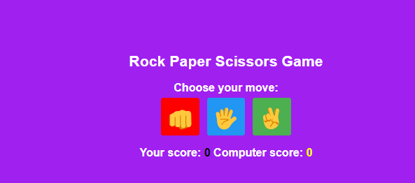
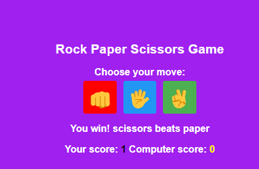

# Rock-Paper-Scissors-Game

## Description
The Rock Paper Scissors Game Web App is a fun and interactive application where users can play the classic game of Rock, Paper, Scissors against the computer. Built with HTML, CSS and JavaScript. The computer will also choose a random option and the results will be displayed. You can win, lose, or tie. Scores are tracked at the bottom. Use HTML for structure, CSS for a modern look, and JavaScript to generate the computer's choice and compare the results. This game is an interactive way to test your luck and strategy against a computer opponent.

## Prerequisites
N/A

## Technologies Used
Built with:
* HTML
* CSS
* JavaScript

## Installation
N/A

## Usage
N/A

## Project Link
Application can can be viewed here: 
* [Live](https://yvonnesarah.github.io/Rock-Paper-Scissors-Game/)

* [Repository](https://github.com/yvonnesarah/Rock-Paper-Scissors-Game)

## Screenshot(S)
Rock Paper Scissors Game

Rock Paper Scissors Game Example

## Credit
N/A

## Licence
Please refer to the LICENSE in the repo.